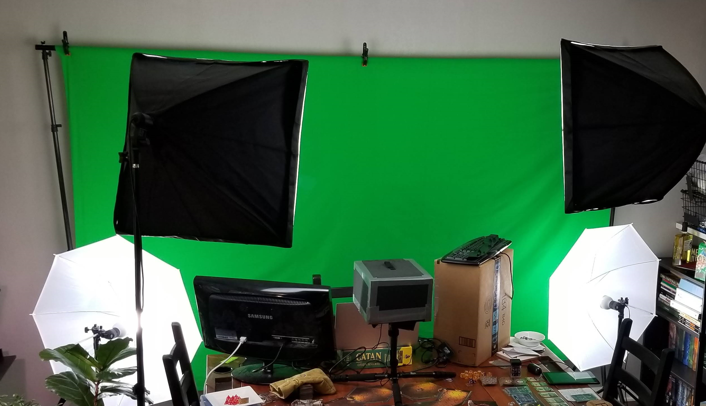
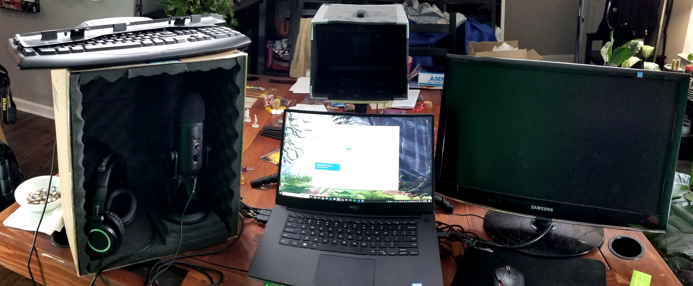
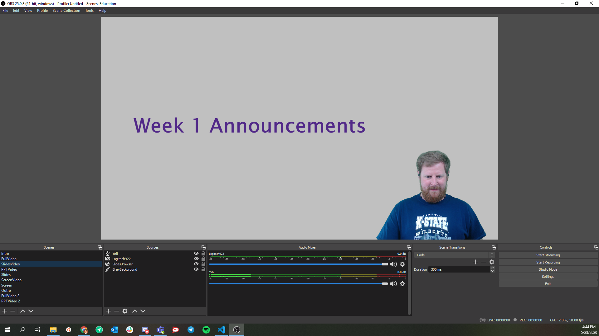
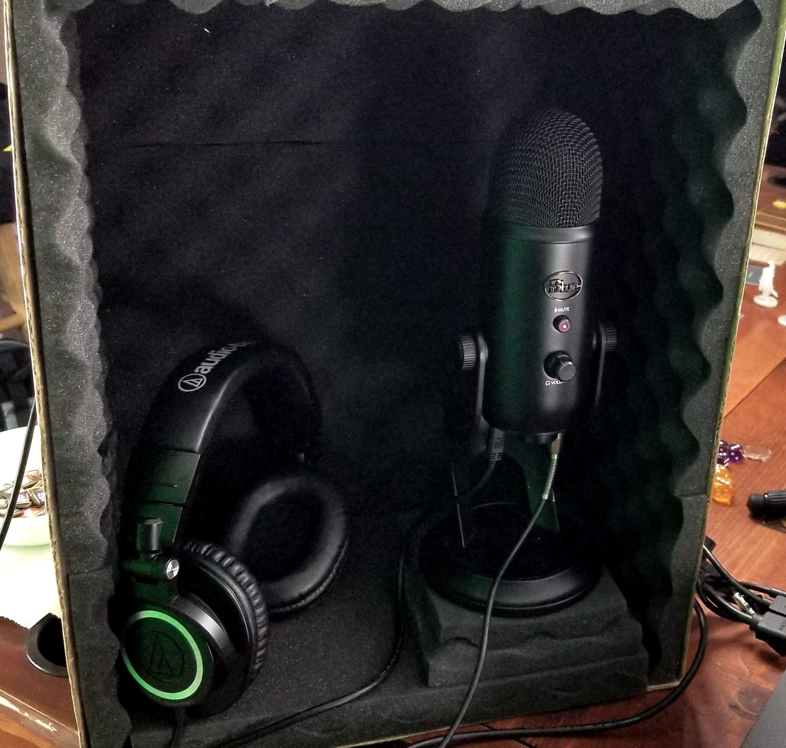
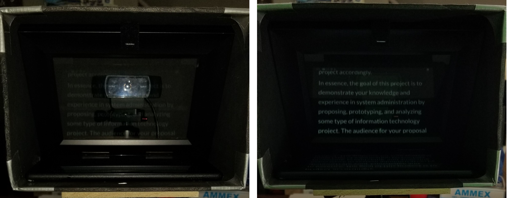

This page serves as a quick guide to the recording setup I use at home. It works well for me, but there are definitely things that can be improved upon or changed. I'll do my best to explain what I've done and why. 

All links below should not be considered endorsements of any products or merchants - I'm just sharing the kit that I am currently using. 

Please feel free to contact me if you have any questions, comments, or suggestions.

## Layout & Lighting

This is the studio that I have set up at home. We have a very small home, so I've basically taken over one end of the dining room table. There's not a ton of space, but it is enough to have a minimal setup.

For lighting, I have a combination backdrop and lighting kit from Emart ([Amazon Link](https://www.amazon.com/dp/B018VILQ2I/)). It was about $155 when I originally purchased it a couple of years ago, but it is no longer available. Right now, there is a similar kit available from Neewer for $225 ([Amazon Link](https://www.amazon.com/dp/B019GTCNXC)). These kits are pretty basic, but give you a great start at getting enough lights to properly light a small green screen backdrop. 

However, these bulb-based kits are a bit bulky, and replacing the bulbs is a bit expensive. There are alternative options, such as this LED-based kit from Neewer, but it is more expensive at $225 for just 2 lights ([Amazon Link](https://www.amazon.com/dp/B07CB4Q3H7)). We use a kit based on these lights in our video studio on campus. 

There are lots of tutorials for lighting a green screen online. I usually refer people to the one from [Newtek](https://www.newtek.com/blog/tips/basic-green-screen-lighting-techniques/). The basic concept is to have two lights facing the subject, one on each side. Typically the key light is a bit brighter than the fill light to give the subject some definition, but I usually don't worry about that. In my setup, I use the two softboxes as my primary subject lights. Then, you'll need to evenly light the backdrop. I use the two umbrellas on either side to help remove any dark corners at the bottom of the screen. However, they are bit too close to the screen and create some bright spots, but they are generally out of frame in the video so it isn't a problem. 

The only thing my setup is missing is a back light, which would help give me a sharper outline. 

## Recording Equipment

My recording equipment is pretty simple:

* **Webcam** - [Logitech C922x](https://www.amazon.com/dp/B01LXCDPPK/). Any webcam will do, but shoot for one that is HD. Some SLR cameras can also be used as webcams.
* **Tripod** - [Sirui 52" Aluminum](https://www.amazon.com/gp/product/B00AZTCHES). Again, any tripod will do. I like this one because it is small and lightweight.
* **Microphone** - [Blue Yeti USB Mic](https://www.amazon.com/dp/B002VA464S/). A high quailty microphone is key. I like the Blue Yeti, but it is very sensitive and has some disadvantages. 
  * An alternative is a good lapel microphone, such as this [Pop Voice](https://www.amazon.com/dp/B016C4ZG74) one, provided your recording device has the correct input. I've not tried this one myself. 
* **Laptop**

There are also a few optional things you might want to include to make your setup even better, but these aren't required to get your studio up and running:
* **Second Monitor** - makes recording your screen much easier since you can control the recording on the secondary screen. 
* **Homemade Teleprompter** (see below) with [Amazon Fire HD 8](https://www.amazon.com/dp/B0794RHPZD) tablet. Any tablet would work. 
  * In our studio, we use an [Ikan PT-ELITE Teleprompter](https://www.amazon.com/dp/B00ZXAZMVE/) and a [Portable Monitor](https://www.amazon.com/dp/B07RGPCQG1) as the screen. 
* **Homemade Microphone Shield** (see below).
  * Professional option: [Pyle Recording Shield](https://www.amazon.com/dp/B0117DB5TI)

## Recording Software

To record my videos, I use [OBS Studio](https://obsproject.com/). It is a great piece of software for recording just about anything on a computer. It does take a bit of work to get it set up at first, since you have to create a set of "scenes" that give the layout of what you'd like to record. 

You can download the scenes that I use [here](education.json). These can then be imported into OBS for use as a starting point in creating your own scenes. I have scenes for recording web-based slides, PowerPoint based slides (presented in fullscreen on the primary monitor), and sharing the computer screen itself. 

Some other minor details about my OBS configuration:
* I recommend setting the **recording format** to .MOV instead of the default .FLV. This means that recordings may be lost if they are interrupted due to a hardware error, but I've never had that happen. The .MOV file format is much easier to import into a video editor later.
* I use a **Noise Suppression** filter on my Blue Yeti microphone, just set to the default -30 dB level. This helps remove quite a bit of background noise and echos that are picked up by my microphone since it is very sensitive. 
* I use a **Chroma Key** filter on my webcam to remove the green screen from the video. I've found that the default settings in OBS work well for my screen and lighting, but you may have to adjust it a bit to match your setup. 
* My camera always makes me look a bit too pale, so I manually adjust the **white balance** of my camera to around 4500. (Right-click on the camera under Sources -> Properties -> Configure Video for me, but I'm not sure all cameras provide that same level of control - consult your camera documentation.)
* I also had to manually configure my camera in the Sources section of OBS to default to a full HD resolution of 1920x1080. 

There are lots of good tutorials online for setting up and configuring OBS. Here's one from [Techer's Tech](https://www.youtube.com/watch?v=gdqOXl6lFB0). 

### Recording Tips

As much as possible, I just start the recording and let the camera run while I work through the content. If I make a mistake, I try to leave a couple of seconds of silence before trying again, usually starting at the beginning of the current slide or paragraph. That will make editing the video later a bit easier. 

Also, try to minimize any background noise in your area. A good microphone like the Blue Yeti mentioned above can pick up noise from across the room. Make sure you have adjusted your microphone gain so that it is loud enough to be heard but not so loud to cause clipping (when you edit the video, if the audio waveform touches the top of the track, it is clipping and you need to reduce your microphone gain). Also, using a noise suppression filter in OBS will help reduce lots of background noise. 

It's OK to take a short break between slides or sections and leave the camera running. Once you are comfortable editing the video, it takes a few seconds to remove that from the video and saves you lots of hassle when recording. 

## Editing

There are lots of video editing software that you can use. I've been using the free version of [DaVinci Resolve 16](https://www.blackmagicdesign.com/products/davinciresolve/) and really have been impressed by what it can do. If you spend a little time getting familiar with it, you'll find that you can quickly cut the bad parts out of a video. [Teacher's Tech](https://www.youtube.com/watch?v=4o-XE-DorMw) has a pretty good tutorial on YouTube. 

This is probably the most technically daunting part of the whole process, but once you get comfortable making edits to your videos, it makes the recording process so much easier. Initially, I focused on getting everything exactly right in just one take, but now I know I can just leave the camera rolling and I can cut out whatever I don't need to make the final product.

Once you are done working in Resolve, I recommend outputting your video in **.MP4 file format using the H.264 codec**. 

## Uploading Videos

Once you've created your video, you have to make it available to your students. K-State offers [Mediasite](https://www.k-state.edu/mediasite/) as one good option. However, due to the way Mediasite handles downscaling of videos, it can make text and graphics on your videos more difficult to read. However, Mediasite does offer some features that other video sites do not have, so it may work well for your needs. 

We've been using [YouTube](https://www.youtube.com/) instead of Mediasite and have been really happy with it. You can upload the video to YouTube as an "unlisted" video, and then either include the link to the video in your class or use the embedding tools availble to embed the video in your class wherever you like. If you choose to use YouTube, I recommend creating a [brand account](https://support.google.com/youtube/answer/9367690?hl=en) for your department so you can easily give others access. 

Additionally, we've found that it is useful to have the actual video files themselves available for some students who have limited internet connectivity. We can make them available on our department's file server on an as-needed basis when students request them, but we don't leave them there for long since they take up quite a bit of space. Tech-savvy students can probably figure out how to download the videos from YouTube as well. 

## Captioning

Captioning your videos can make them accessible to many more students, and even students who don't need the captions report that they like to use them anyway, just to make it easier to understand the content in the video.

K-State offers a few options for Mediasite in their [Mediasite Help & Training](https://www.k-state.edu/mediasite/help/add-closed-captions.html). 

There are a few different ways to caption your videos on YouTube:
* Any video uploaded to YouTube will be automatically captioned by their AI tools. The captions can then be edited using their online editing tool. It works well, and is a pretty great option for being free.
* We've been using [Otter.ai](https://otter.ai/) to generate captions for our videos. We've found that the generated captions from Otter are generally better than those from YouTube. It only costs $5/month for 6000 minutes of captioning. Once the video file has been processed, you'll need to export the text in the .SRT file format. 
* To edit the captions, I've been using [Subtitle Edit](https://www.nikse.dk/subtitleedit/). I've found that I usually need to correct some of the more technical terminology in the captions, and every once in a while the AI transcription will put sentence breaks in the wrong place or miss them entirely. 
* Once the captions are edited, you can [upload the finalized SRT file to YouTube](https://support.google.com/youtube/answer/2734796?hl=en).

## Custom Pieces

Over time, I've added a couple of custom pieces to my recording setup:

* **Homemade microphone isolation box**: just some [acoustic foam panels](https://www.amazon.com/dp/B07BX3K3ZD/) glued to the inside of a cardboard box. This helps reduce the amount of echo that my microphone picks up since my house has solid walls and hard floors. Ideally, your recording space would have lots of soft things to absorb these echos. For example, radio producers have been known to record in a closet full of clothes or under a thick blanket to reduce echo. You can also purchase a more professional option, such as a [Pyle Recording Shield](https://www.amazon.com/dp/B0117DB5TI)

* **Homemade teleprompter**: my students complained that it felt like I wasn't looking at the screen when I spoke. They were right! I wasn't looking at the camera because I was reading my script from my laptop situated below the camera. To fix this, I built a homemade teleprompter loosely based on [this guide](https://www.youtube.com/watch?v=xxIE-xBzbeA). It's basically a picture frame at a 45 degree angle inside of a box made of black foam core. The webcam is behind the glass, but the text can be read on the tablet placed below. The trickiest part is getting text to show up on the tablet reversed. There are several apps made for this purpose, but I developed my own [Hugo Template](https://github.com/russfeld/ksucs-hugo-theme) that handles this for me by creating a website with my script on it ([example](https://core.cs.ksu.edu/0-introduction/00-introduction-trial/tele.html)). I'd be happy to share this with anyone interested, but it requires a bit more technical expertise to get it set up and running. In our video studio, we use a [Ikan PT-ELITE Teleprompter](https://www.amazon.com/dp/B00ZXAZMVE/) and a [Portable Monitor](https://www.amazon.com/dp/B07RGPCQG1), but that is more expensive than my entire home setup!

That's all I can think of! If you have any comments, questions or suggestions, please contact me!